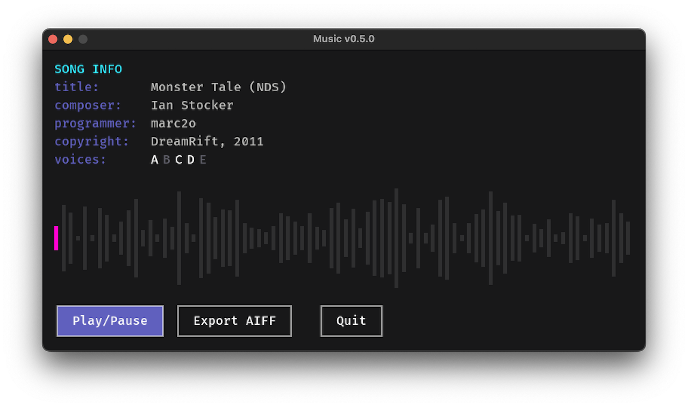

# Read me

This project, aptly named »Music«, is a synthesizer and MML parser written from scratch in Lua/[LÖVE](https://love2d.org/). It is a complete rewrite of my first attempt and this time around I have completely written the synthesizer and parser code myself (and have learned a lot in doing so).

The synthesizer capabilities are loosely based on the NES. 

## Usage

Open any an MML file (either `.txt` or `.mml`) per drag-n-drop on the LÖVE app icon or the app window while Music is running.

Use `[Tab]` to play or pause the music.

Use `[F1]` to export as AIFF and `[F2]` for MIDI (Format 1) export.

AIFF and MIDI files are saved at LÖVE’s default location, which is

- `~/Library/Application Support/LOVE/` on macOS
- `%appdata%\LOVE\` on Windows
- `~/.local/share/love/` on Linux

(see [love.filesystem](https://love2d.org/wiki/love.filesystem)).

## Basic Song Setup

### Header Credits

Meta data is defined using keywords.

- `#TITLE`: song title
- `#COMPOSER`: the original composer of the song
- `#PROGRAMMER`: the person who coded the song into MML
- `#COPYRIGHT`: well, …
- `#TIMEBASE`: default value is `480`

### Channels or Voices 

There are 5 channels or voices to work with:

- `A` is the first pulse wave channel
- `B` is the second pulse wave channel
- `C` is the triangle wave channel
- `D` is the sawtooth wave channel
- `E` is the white noise channel

### Tempo Settings

The tempo is set in beats per minute using the `t<bpm>` command, e.g.:

	t120

This command is used before the channels and music data as it sets the tempo for all 5 channels.

### Volume Settings

The volume is set using the `v<number>` command. The command can be used anywhere in the music, at the beginning of a channel and between notes.

The pulse wave channels `A` and `B` as well as the sawtooth channel `D` and the noise channel `E` accept values between `0 .. 127`. For the triangle channel `C` the volume can only be turned on `1` or off `0`.

	A v80 cdefg

Volume envelopes can be created using `@env` macros by defining  attack (time), decay (time), sustain (volume) and release (time).

	@env1 = { 1, 32, 64, 80 }

### Quantization

Since the triangle channel does not support volume controls and envelope macros, quantization can be used to make notes sound snappier. The quantization is set using the `q<1..8>` command. The notes are divided into 8 equal parts. The value following the `q` command defines how many parts are played before the note is cut off.

### Duty Cycle

For the two pulse wave channels `A` and `B` the duty cycle can be set using the duty cycle macro `@<00..03>`. The duty cycle is the ratio of the pulse width to the pulse period. The values correspond to:

- `00` 12.5 % thin raspy sound
- `01` 25 % thick  fat sound
- `02` 50 % smooth clear sound
- `03` 75 % same as 25 % but phase-inverted

### Programming Notes

For the pitches of notes the usual letters are used. For `h` also `b` can be used.

	A c d e f g4 a16 h16 >c c d e f g4 a16 h16 >c<<

Sharp notes and flat notes are accomplished by adding either `#` (or `+`) and `-` respectively after the note, e. g. `f#`.

The length of a note is either added after the note or set as a default value for phrases or the whole channel using the `l<value>` command. The length values represent standard note lengths such as `4` for a quarter note and `16` for a sixteenth.

Dotting a note increases the duration of that note by half of its value.

	A l8 c d e. f2 g4 r

Pauses (or rests) are set using the `p<value>` or `r<value>`command. A wait `w<value>` is a rest without silencing the previous note.

Notes can be tied to each other using the `&` symbol.

### Octaves

The default octave can be set for a channel and changed any time between the notes using the `o<number` command. `o4` represents the octave around the standard pitch a = 440 Hz.

Within phrases the octave can be shifted up and down using the octave shift commands `>` and `<` respectively.

### Loops (not yet implemented)

A phrase can be looped n times using square brackets `[` `]<n>`.

	A [c d e c]2

### Additionally

Comments can be used to make annotations or write lyrics. A comment is everything between the `;` and the end of a line.

	A c  d  e  f  g   a  h >c 
	; do re mi fa sol la ti do

## To Do

The following features are not yet implemented:

- Ties (`&`)
- Loops (`[..]<n>n`)
- Arpeggio macro (`@arp<n>`)
- Vibrato (pitch modulation `@vib<n>`)
- Filters (at least lowpass)
- MIDI export

## References

- [MCK/MML Beginners Guide by nullsleep version 1.0](https://archive.nesdev.org/mck_guide_v1.0.txt)
- [Music Macro Language (Electronic Music Wiki)](https://electronicmusic.fandom.com/wiki/Music_Macro_Language)
- [Standard MIDI-File Format Spec. 1.1, updated](http://www.music.mcgill.ca/~ich/classes/mumt306/StandardMIDIfileformat.html)
- [Audio Interchange File Format: AIFF (PDF, McGill University)](https://www-mmsp.ece.mcgill.ca/Documents/AudioFormats/AIFF/Docs/AIFF-1.3.pdf)
